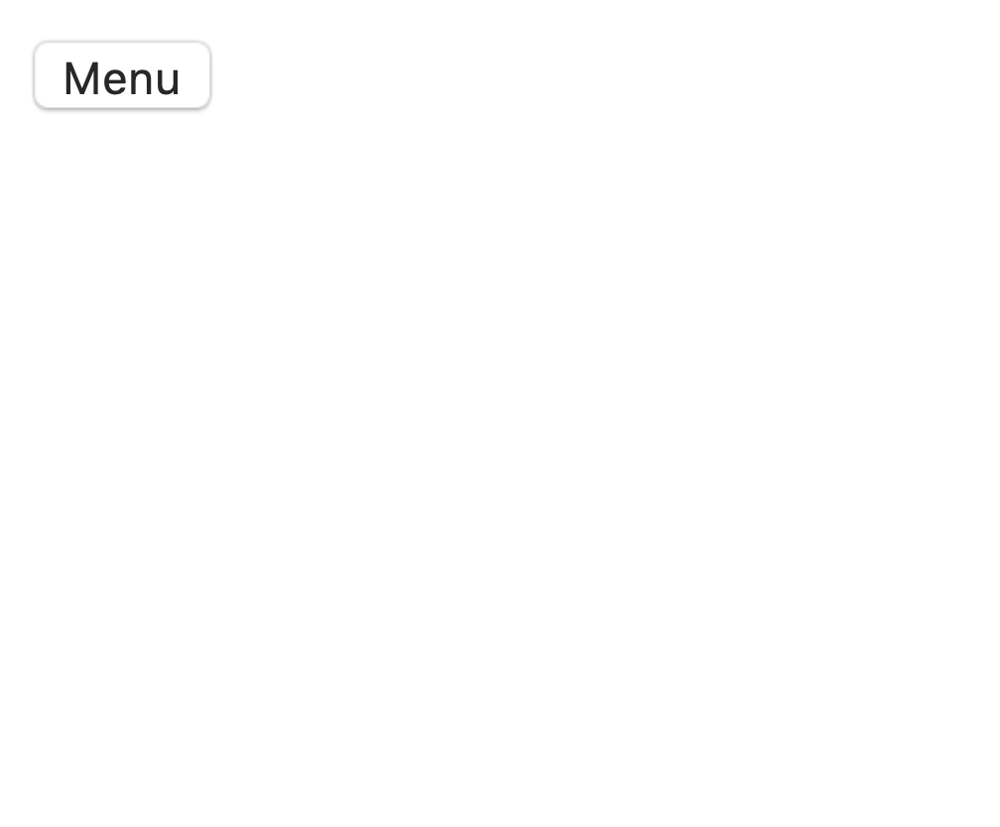
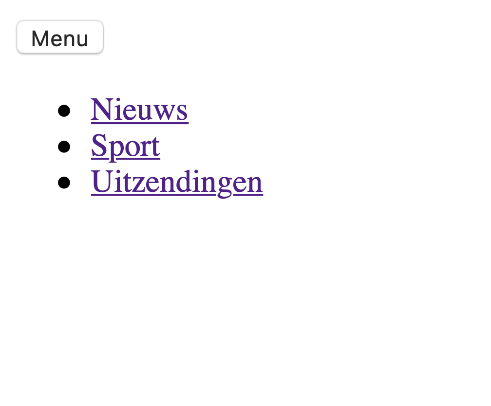
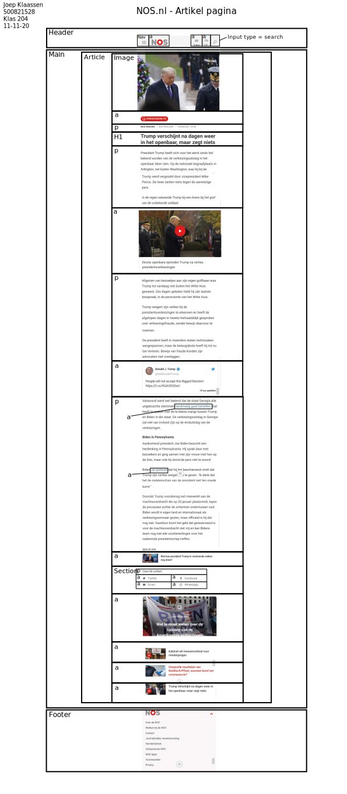
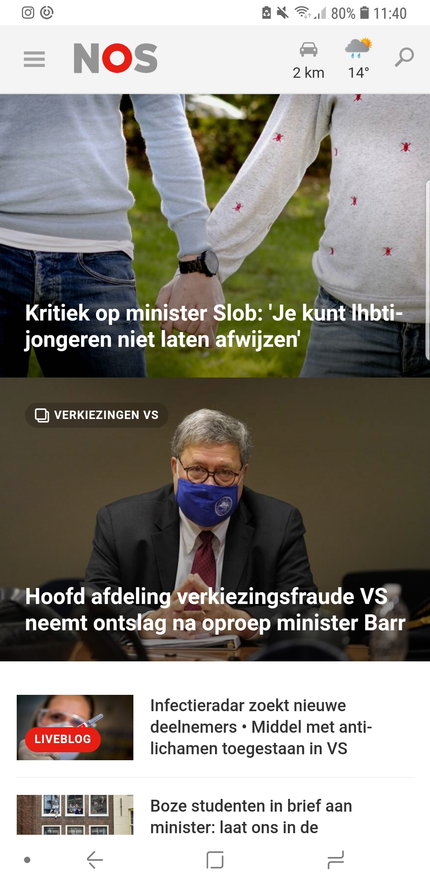
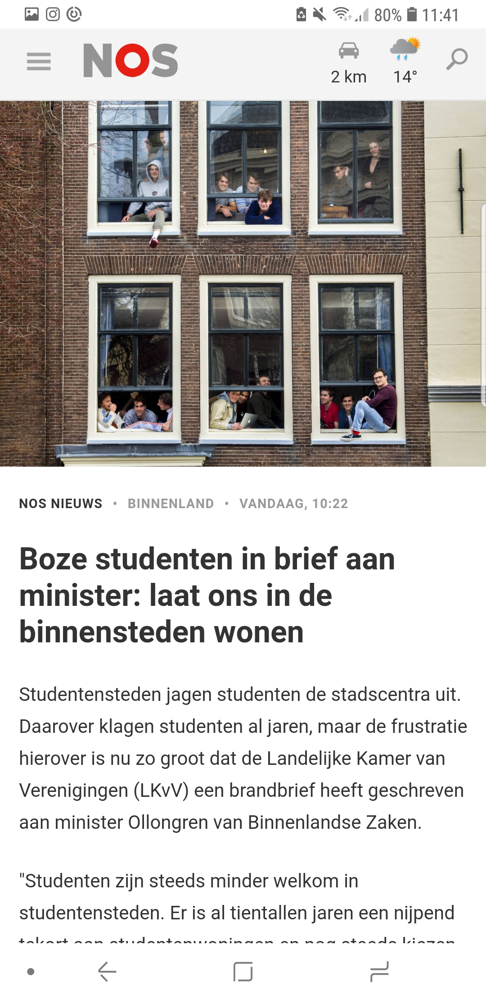

# Procesverslag
**Auteur:** Joep Klaassen

Markdown cheat cheet: [Hulp bij het schrijven van Markdown](https://github.com/adam-p/markdown-here/wiki/Markdown-Cheatsheet). Nb. de standaardstructuur en de spartaanse opmaak zijn helemaal prima. Het gaat om de inhoud van je procesverslag. Besteedt de tijd voor pracht en praal aan je website.

## Bronnenlijst
1. -bron 1-
2. -bron 2-
3. -...-

## Eindgesprek (week 7/8)

-dit ging goed & dit was lastig-

**Screenshot(s):**

-screenshot(s) van je eindresultaat-

## Voortgang 3 (week 6)

-same as voortgang 1-

## Voortgang 2 (week 5)

-Ik ben een stuk langer dan verwacht bezig geweest met mijn navigatie.-

**Screenshot(s):**

### Agenda voor meeting

Ian - Wilt hulp bij zijn javascript.
Merel - Wilt weten hoever het formulier gemaakt moet worden.
Bente - Wilt graag hulp met JS voor de "slider".
Joep - Wilt weten of je meerdere ul in de navigatie mag gebruiken.

## Voortgang 1 (week 3)

### Stand van zaken

-dit ging goed & dit was lastig-

**Screenshot(s):**

-screenshot(s) van hoe ver je bent met korte uitleg-

### Agenda voor meeting

-samen met je groepje opstellen-

| Ian            | Joep                 | Bente                   | Merel           |
| ---            | ---                  | --                      | --              |
| Positionering  | Hoe je de website    | Hoe plaats je           | Hoe laat je een |
| van plaatjes?  | makkelijk responsive | een dropdown            | hamburger menu  |
|                | maken.               | icoon naast de summary? | werken?         |     

### Verslag van meeting

-na afloop snel uitkomsten vastleggen-

## Breakdownschets (week 1)

-uitwerken voor de 1e werkgroep - eind van de eerste week-

## Intake (week 1)
-uitwerken voor de kick-off werkgroep - begin van de eerste week-

**Je startniveau:** - Mijn startniveau is blauw (beginner).

**Je focus:** -Ik ga mijn focus leggen op responsive.

**Je opdracht:** - https://nos.nl

**Screenshot(s) van de eerste pagina (small screen):**

**Screenshot(s) van de tweede pagina (small screen):**

